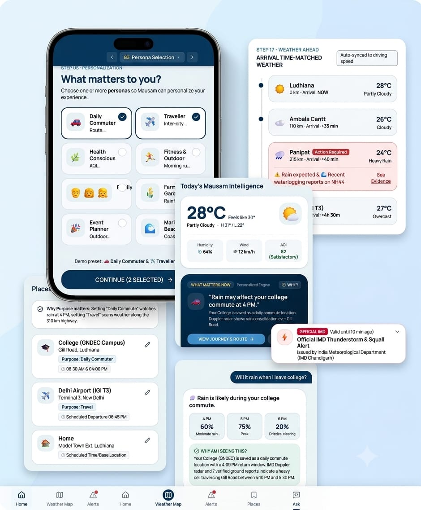

# 🌦️ MAUSAM — AI-Powered Personalized Weather Intelligence

<p align="center">
  <strong>Weather is universal. Its impact is personal.</strong>
</p>

<p align="center">
  An AI-powered personalized weather intelligence platform designed to make weather information more relevant, contextual, and actionable for every user.
</p>

<p align="center">
  
  
  
  <!-- 
  
   -->
</p>

---

## 📋 Table of Contents

- [Overview](#-overview)
- [Problem Statement](#-problem-statement)
- [Our Solution](#-our-solution)
- [Why MAUSAM?](#-why-mausam)
- [Key Features](#-key-features)
  - [Personalized Homepage](#1-personalized-homepage)
  - [Persona Intelligence](#2-persona-intelligence)
  - [Context-Aware Personalization](#3-context-aware-personalization)
  - [Intelligent Information Prioritization](#4-intelligent-information-prioritization)
  - [Safety Override](#5-safety-override)
  - [Why Am I Seeing This?](#6-why-am-i-seeing-this)
  - [Intelligent Alerts](#7-intelligent-alerts)
  - [Interactive Weather Map](#8-interactive-weather-map)
  - [Ground Reality](#9-ground-reality)
- [How MAUSAM Works](#-how-mausam-works)
- [User Flow](#-user-flow)
- [Tech Stack](#-tech-stack)
- [Team](#-team)

---

# 📌 Overview

**MAUSAM** is a personalized weather intelligence platform designed around a simple idea:

> **Weather is universal. Its impact is personal.**

Different people experience the same weather differently.

* A farmer may care about rainfall and agricultural advisories.  
* A runner may care about heat, humidity, wind and air quality.  
* A traveller may care about destination weather and severe-weather conditions.  
* A commuter may care about rain, fog and visibility.  
* An event planner may care about rainfall probability and weather conditions during the event.

Traditional weather applications provide large amounts of information, but users are often required to decide **what information matters to them**.

MAUSAM introduces a **Persona Intelligence Layer** that dynamically organizes weather information according to the user's:

```text
Persona
   +
Location
   +
Time
   +
Weather Conditions
   +
Severity
   +
Preferences
   +
Saved Locations
   +
Relevant Warnings
```
---

## 🚨Problem Statement

> ### PS 26076 — Development of personalized homepage for 'Mausam' mobile application

The **Mausam** mobile application should provide a personalized homepage that highlights the weather information most relevant to different types of users.

### 👥 User-Specific Weather Needs

| User Type | Information to Highlight |
|---|---|
|  **Health-conscious users** | AQI, pollen count, UV index, humidity levels to help manage allergies, asthma, or skin sensitivity. |
|  **Outdoor fitness enthusiasts** | Sunrise/sunset times, “best running hours”, wind speed, and heat alerts for workout planning. |
|  **Beachgoers & surfers** | Sea conditions, tide timings, wave height, and water temperature for safe and enjoyable beach activities. |
|  **Travelers** | Saved destinations, severe weather alerts for flights, and packing suggestions such as “Carry a raincoat in London”. |
|  **Parents & families** | School commute conditions, rain alerts, and severe weather warnings to plan daily routines. |
|  **Agriculture & gardeners** | Soil moisture, rainfall predictions, frost alerts, and seasonal planting guidance. |
|  **Commuters** | Weather with traffic updates, visibility conditions, and alerts for storms or fog that may affect travel. |
|  **Event planners** | Extended forecasts, probability of rain, and “comfort index” for outdoor gatherings and weddings. |

### 📌 Problem Statement Details

| | |
|---|---|
| **Problem Statement ID** | `26076` |
| **Organization** | Ministry of Earth Sciences (MoES) |
| **Department** | India Meteorological Department |
| **Category** | Software |
| **Theme** | Smart Automation |

---

## Our Solution

### 🌦️ MAUSAM — Personalized Weather Intelligence

MAUSAM introduces a **Personalization Intelligence Layer** to the existing Mausam experience.

Instead of showing every user the same weather information, MAUSAM intelligently **prioritizes and organizes relevant information** based on the user's context.

### 🧠 How Our Solution Works

MAUSAM considers multiple factors before deciding what should be highlighted on the user's homepage:

```text
         User Persona
              +
         Location
              +
           Time
              +
         Weather
              +
         Severity
              +
        Preferences
              +
        Saved Places
              +
        Weather Warnings
              │
              ▼
    ┌──────────────────────┐
    │ Personalization      │
    │ Intelligence Layer   │
    └──────────┬───────────┘
               ▼
    ┌──────────────────────┐
    │ Relevant Information │
    │ & Insights           │
    └──────────┬───────────┘
               ▼
    ┌──────────────────────┐
    │ Personalized         │
    │ MAUSAM Homepage      │
    └──────────────────────┘
```
---
## 💡Core Idea
>
> **MAUSAM does not aim to create more weather data.**
>
> It aims to make existing weather information **<mark>more relevant, understandable, and actionable</mark>** for each user.
---
## Why MAUSAM?

### 🌦️ **Weather Is Universal. Its Impact Is Personal.**

The same weather condition can mean **completely different things to different people**.

- 🌧️ **Rain**
  - For a **farmer** → potentially useful rainfall
  - For a **commuter** → possible travel disruption
  - For a **traveller** → change in travel plans
  - For an **event planner** → possible cancellation or rescheduling

- 🌡️ **High Temperature**
  - For a **fitness enthusiast** → unsafe outdoor workout conditions
  - For a **health-conscious user** → potential health concern
  - For a **farmer** → possible crop stress

### 🎯 **The Gap We Address**

Traditional weather applications primarily answer:

> **“What is the weather?”**

MAUSAM aims to answer the next and more important question:

> **“What does this weather mean for me?”**

### 🧠 **Why MAUSAM Is Different**

- ** Personal**
  - Information is organized around the **user's needs and interests**.

- ** Context-Aware**
  - Personalization considers **location, time, weather conditions, severity and saved places**.

- ** Relevant**
  - Instead of giving equal importance to every weather parameter, MAUSAM **prioritizes what matters most**.

- ** Safety-First**
  - **Critical official weather warnings remain visible**, regardless of the user's persona.

- ** Explainable**
  - Users can understand **why a particular insight or recommendation is being shown**.

- ** Action-Oriented**
  - Weather information is presented with the goal of helping users **understand and make decisions**, rather than simply viewing weather data.

### 🔄 **From Weather Data to Personal Weather Intelligence**

```text
         Weather Data
               ↓
        User Context
               ↓
        Personalization
               ↓
        Relevant Information
               ↓
        Actionable Insight
```
---
## Key Features

### 🏠 **1. Personalized Homepage**

The homepage dynamically organizes weather information according to the **user's needs, preferences and current context**.

-  User-specific information
-  Location-aware content
-  Time-aware recommendations
-  Weather-based prioritization
-  Relevant alerts and warnings
-  Support for saved locations

> **One weather system. Different information priorities for different users.**

---

### 👤 **2. Persona Intelligence**

MAUSAM allows users to select the type of weather information that is most relevant to them.

Supported personas include:

-  **Health-conscious User**
-  **Outdoor Fitness Enthusiast**
-  **Beachgoer / Surfer**
-  **Traveller**
-  **Parent / Family**
-  **Farmer / Gardener**
-  **Commuter**
-  **Event Planner**

The selected persona becomes one of the inputs used to **personalize the homepage experience**.

---

### 🧠 **3. Context-Aware Personalization**

MAUSAM goes beyond a fixed user persona.

Personalization considers:

-  **Persona**
-  **Location**
-  **Time**
-  **Weather Conditions**
-  **Severity**
-  **Preferences**
-  **Saved Locations**
-  **Active Warnings**

This allows the homepage to **adapt according to the user's current situation**.

---

### 🎯 **4. Intelligent Information Prioritization**

Not every piece of weather information is equally important at every moment.

MAUSAM ranks information according to its **relevance to the user**.

For example:

```text
🏃 Fitness User + High Heat
            ↓
      Heat Alert
            ↓
   Best Activity Time
            ↓
       Humidity
            ↓
          Wind
```
---
### 🛡️ **5. Safety Override**

Personalization should never compromise **safety**.

Critical official weather warnings receive **higher priority than personalized content**.

-  **Severe weather warnings** remain visible
-  **Safety-critical information** cannot be hidden by personalization
-  **Personalized information** is prioritized only after safety requirements are satisfied

```text
         Official Warning
                ↓
         Safety Override
                ↓
      Always Visible to User
                ↓
     Personalized Content
```
---

### 🔎 6. Why Am I Seeing This?

MAUSAM makes personalization explainable.

Users can understand why a particular card, insight, or recommendation appears on their homepage.

Possible reasons include:

-  Your selected persona
-  Your current location
-  Current weather conditions
-  Time of day
-  Weather severity
-  Saved destination
-  Active warning

> 💡 Personalization should not feel like a black box.

---

### 🔔 7. Intelligent Alerts

MAUSAM transforms generic weather alerts into context-aware information.

Instead of:

> 🌧️ Heavy rain expected.

MAUSAM can provide:

> 🌧️ Heavy rain is expected during your selected travel period.

Alerts can be relevant to:

-  Commute
-  Travel
-  Fitness
-  School / Family
-  Outdoor Events
-  Agriculture
-  Severe Weather

---

### 🗺️ 8. Interactive Weather Map

The weather map acts as a supporting visualization layer for exploring weather conditions across locations.

Users can:

-  Explore different locations
-  View weather conditions
-  Interact with weather time information
-  Explore weather events
-  Understand location-based conditions

> 💡 The map supports the personalized experience; it is not the core innovation of MAUSAM.

---

### 📍 9. Ground Reality

Ground Reality provides a complementary layer for local, user-reported weather observations.

Users can contribute:

-  Photos
-  Videos
-  Local observations
-  Location
-  Time of observation

The system can help distinguish between:

-  Official weather information
-  Citizen reports
-  Unverified observations
-  Trusted / verified information

> 💡 Ground Reality complements official weather data rather than replacing it.

---

## How MAUSAM Works

MAUSAM works by combining **user context, weather information, and personalization logic** to determine what information should be highlighted on the user's homepage.

### 🔄 **MAUSAM Workflow**

```text
👤 User
   │
   ▼
🎯 Select Persona & Preferences
   │
   ▼
📍 Select Current / Saved Locations
   │
   ▼
🌦️ Weather & Environmental Data
   │
   ▼
🧠 Context Analysis
   │
   ├──  Persona
   ├──  Location
   ├──  Time
   ├──  Weather Conditions
   ├──  Severity
   ├──  Preferences
   └──  Active Warnings
   │
   ▼
🎯 Personalization Engine
   │
   ▼
📊 Information Prioritization
   │
   ▼
🛡️ Safety Override
   │
   ▼
🏠 Personalized MAUSAM Homepage
   │
   ├──  Intelligent Alerts
   ├──  Weather Insights
   ├──  Weather Map
   ├──  Ground Reality
   ├──  Journey / Weather Ahead
   └──  Why Am I Seeing This?
```
---

## 🎯✨ Project at a Glance


---

## User Flow

The MAUSAM user flow is designed to take the user from **initial onboarding to a personalized weather experience**.

```text
                    🚀 START
                       │
                       ▼
              👋 Welcome to MAUSAM
                       │
                       ▼
              👤 Select Persona
                       │
                       ▼
             ❤️ Select Interests
                       │
                       ▼
               📍 Select Location
                       │
                       ▼
              📌 Add Saved Places
                       │
                       ▼
          ⚙️ Personalization Setup
                       │
                       ▼
             🏠 Personalized Home
                       │
        ┌──────────────┼──────────────┐
        │              │              │
        ▼              ▼              ▼
   🗺️ Weather Map   🔔 Alerts    🧳 Journey
        │              │              │
        └──────────────┼──────────────┘
                       │
                       ▼
                💡 Weather Insights
                       │
          ┌────────────┴────────────┐
          │                         │
          ▼                         ▼
   📍 Ground Reality          🤖 Ask MAUSAM
          │                         │
          └────────────┬────────────┘
                       ▼
              🔎 Why Am I Seeing This?
                       │
                       ▼
                🔄 Updated Context
                       │
                       ▼
             🎯 Adapted Homepage
```
### 👋 1. Onboarding

The user starts the MAUSAM experience and is introduced to the personalized weather concept.

-  Welcome screen
-  Basic onboarding
-  Introduction to personalized weather information

---

### 👤 2. Select Persona

The user selects the persona that best represents their needs.

Examples:

-  **Health-conscious**
-  **Fitness enthusiast**
-  **Traveller**
-  **Farmer / Gardener**
-  **Commuter**
-  **Parent / Family**
-  **Beachgoer / Surfer**
-  **Event Planner**

---

### ❤️ 3. Select Interests

The user can select the weather information they care about most.

This helps MAUSAM understand the user's **information preferences**.

---

### 📍 4. Select Location

The user provides their relevant location.

-  Current location
-  Home
-  Other saved locations
-  Travel destinations

---

### ⚙️ 5. Personalization Setup

MAUSAM combines the user's:

- **Persona**
- **Interests**
- **Location**
- **Saved places**
- **Preferences**

to create the user's initial **personalization context**.

---

### 🏠 6. Personalized Homepage

The user reaches the main MAUSAM homepage.

Instead of presenting every piece of information equally, the homepage prioritizes **what is most relevant to the user**.

The homepage can contain:

-  Current weather
-  Personalized insights
-  Relevant alerts
-  Forecasts
-  Saved locations
-  Contextual advisories

---

### 🗺️ 7. Explore Weather

From the homepage, users can access additional weather experiences.

-  **Weather Map**
-  **Journey / Weather Ahead**
-  **Alerts**
-  **Ground Reality**
-  **Ask MAUSAM**

These features provide deeper information when the user needs it.

---

### 🔎 8. Understand Personalization

Users can select:

> **"Why Am I Seeing This?"**

to understand why a particular weather insight or recommendation has been highlighted.

---

### 🔄 9. Continuous Adaptation

The experience can change as the user's context changes.

For example:

```text
 Location Changes
       +
 Time Changes
       +
 Weather Changes
       +
 Severity Changes
       ↓
 Recalculate Relevance
       ↓
 Update Information Priority
       ↓
 Adapted Homepage
```
> 💡 **The user does not need to manually search through multiple weather services. MAUSAM automatically brings the most relevant weather information forward based on the user's current context.**

---

## Tech Stack

| Technology | Type | Connection |
|---|---|---|
|  **React** | Frontend Framework | → Backend |
|  **Flutter** | Frontend Framework | → Backend |
|  **Node.js** | Backend Runtime | → Database / APIs / AI |
|  **FastAPI** | Backend Framework | → Database / APIs / AI |
|  **PostgreSQL** | Database | ← Backend |
| **PostGIS** | Spatial Database Extension | ← PostgreSQL |
| **GPS** | Location Technology | → Maps & Location |
| **Google Maps API** | Maps & Location | ← GPS / Backend |
| **Open-Source Maps** | Maps & Location | ← GPS |
| **Cloud Storage** | Storage | ← Backend |
| **FCM** | Notifications | ← Backend |
| **Web Push** | Notifications | ← Backend |
| **AI/ML Models** | Assistive AI | ← Backend + Weather Data |

---

## Team

| S.No | Team Member | LinkedIn |
|---|---|---|
| 1 | **Sushant kumar Mishra** | [LinkedIn](https://www.linkedin.com/in/mishragisonline) |
| 2 | **Surbhi Sharma** | [LinkedIn](https://www.linkedin.com/in/surbhi-sharma-tech) |
| 3 | **Riya** | [LinkedIn](https://www.linkedin.com/in/riya-bansal-a1731a37a) |
| 4 | **Vipul Sethi** | [LinkedIn](https://www.linkedin.com/in/vipul-sethi-b1508937a) |
| 5 | **Neeraj Kumar** | [LinkedIn]([www.linkedin.com/in/neerajkumarlearner](https://www.linkedin.com/in/neerajkumarlearner/?lipi=urn%3Ali%3Apage%3Ad_flagship3_profile_view_base_contact_details%3B1lAwVieSTJKhc8eyVmmWMQ%3D%3D)) |
| 6 | **Sharanpreet Kaur** | [LinkedIn](https://www.linkedin.com/in/sharanpreet-kaur-1a00a037a) |

---

## Thank You

Thank you for exploring **MAUSAM — AI-Powered Personalized Weather Intelligence**.

> **Weather is universal. Its impact is personal.**

Built with the vision of making weather information **more relevant, understandable, and actionable for every user.**

**Smart India Hackathon 2026 · PS 26076**

---
